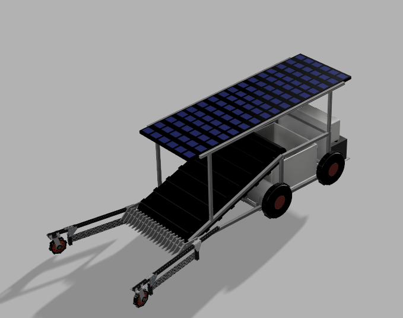

<h1 style="text-align: center;"> Coast Cleanup Cruiser </h1>
<h3 style="text-align: center; font-style: italic;"> A new solution to beach pollution! </h3> 

 The Coast Cleanup Cruiser is beach cleaning... reimagined! At its core, the Cruiser is an open-source design platform for autonomous beach cleaning robots. The complete design provided serves as an example of what's possible, but also leaves room for those building to make additions/modifications as needed. The project's repository contains this baseline design (3d models), as well as documentation pertaining to this specific design and a more generally applicable coding outline for the autonomous functionality. Example code was omitted due to the variability in locations and hardware, each requiring unique approaches. Nonetheless, the supplied outline contains a detailed outline of the core functionality. It is likey that those recreating our project would benefit from making use of <a href="https://opencv.org/"> OpenCV</a>, an impressive computer vision library.

 
This project was developed as part of the course Synthesis 100 (SYN 100) at UC San Diego. This course saw the four of us complete the design, compile a BOM, plan a coding outline, drafting accompanying documentation and webpage in a 5 week span during our Fall 2022 quarter. 
The supplied designs have been subitted for potential inclusion in the Synthesis Digital Collection. 

 If selected, this project will be added to the Digital Collection at some point in the second half of 2023. 
 
<h3> Pages </h3>
<ul>
    <li>
        <a href="https://conrado-m-ucsd.github.io/SYN-100-Project/pages/motives.html">Project Motivations</a> 
    </li> 
    <li>
        <a href="https://conrado-m-ucsd.github.io/SYN-100-Project/pages/dsgn-crit.html">Design Criteria</a> 
    </li> 
    <li>
        <a href="https://conrado-m-ucsd.github.io/SYN-100-Project/pages/result.html">Results</a> 
    </li> 
    <li>
        <a href="https://conrado-m-ucsd.github.io/SYN-100-Project/pages/phys-ch.html">Physical Characteristics</a> 
    </li> 
    <li>
        <a href="https://conrado-m-ucsd.github.io/SYN-100-Project/pages/ele-ch.html">Electronic Characteristics</a> 
    </li>     
    <li>
        <a href="https://conrado-m-ucsd.github.io/SYN-100-Project/pages/bom.html">Bill of Materials </a> 
    </li>     
</ul>

 Visit the Github repository <a href="https://github.com/Conrado-M-UCSD/SYN-100-Project">here</a>.